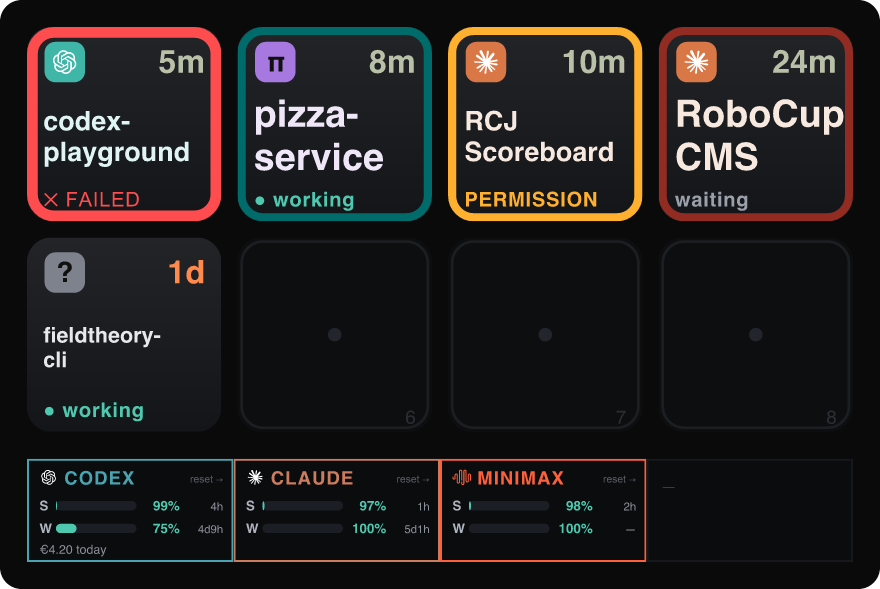
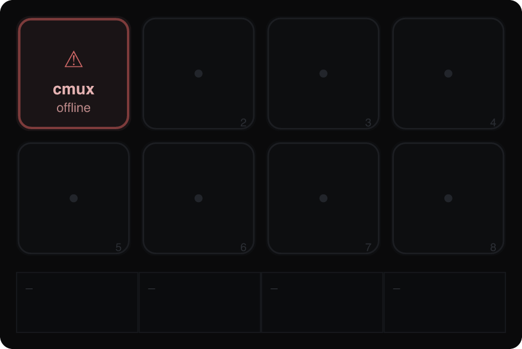

# Muxboard: a Stream Deck+ dashboard for cmux AI coding agents

> Monitor your [cmux](https://cmux.io) AI coding agents (Claude Code, Codex, Pi)
> from an Elgato Stream Deck+: which agents need attention show on the keys, and
> your CodexBar usage limits show on the LCD.




Muxboard turns the 8 keys of an Elgato Stream Deck+ into a queue of
[cmux](https://cmux.io) panes whose coding agents (Claude Code, Codex, Pi, or any
other) have finished, failed, gotten blocked, or are waiting for your input. The
LCD touch strip shows CodexBar usage: session and weekly quota, limits, and spend
per provider.

The newest attention item is key 1 (top-left); the queue fills left-to-right,
top-to-bottom:

```
1 2 3 4      key 1 = newest attention item
5 6 7 8      key 8 = 8th newest
```

Press a key to bring cmux to the foreground and jump straight to that
workspace/surface. Empty slots render muted. When cmux or CodexBar is
unreachable, the display degrades gracefully and the rest keeps working:



## Install

macOS, with Node.js, the [Elgato Stream Deck app](https://www.elgato.com/stream-deck),
and [cmux](https://cmux.io) installed:

```bash
curl -fsSL https://raw.githubusercontent.com/mrshu/muxboard/main/scripts/setup.sh | bash
```

It downloads the latest packaged plugin from
[Releases](https://github.com/mrshu/muxboard/releases/latest), installs it and the
8-key + 4-dial profile, and checks that cmux automation mode is enabled (see
[Requirements](#requirements)). Then open the Stream Deck app and pick the Muxboard
profile. To build from source instead, see [Quick start](#quick-start).

## How it works

| Surface | Shows | Source |
| --- | --- | --- |
| 8 keys | Attention queue: agent glyph, status, repo, age | `cmux list-notifications --json` |
| LCD strip (4×200×100) | One CodexBar provider per segment: session + weekly quota, spend | `codexbar serve` HTTP |
| 4 dials | Scroll, filter, refresh | local state |

> Required cmux setting. cmux's control socket rejects processes outside a
> cmux session by default (`socketControlMode: cmuxOnly`), and the Stream Deck
> app launches plugins outside any session. Set cmux Settings → Automation →
> Socket Control Mode → Automation (then fully quit and relaunch cmux) so the
> plugin is accepted. Without it, the keys stay on the muted "cmux offline"
> state. See [Requirements](#requirements).

- Keys are assigned to physical slots newest-first, with the panes that need you
  pinned ahead of those actively working. Agent, status, and age are fused from
  several cmux signals (no terminal scraping); see
  [How a pane's state is derived](#how-a-panes-state-is-derived).
- Tapping a key runs `cmux open-notification --id <uuid>`, which focuses the
  workspace + surface and marks the row read (it does not dismiss it).
- Long-pressing a key (hold ~0.6s) runs `cmux dismiss-notification --id <uuid>`,
  removing it from the queue ("seen it, nothing further") without switching to
  cmux. The key clears on the next poll.
- The LCD shows one segment per CodexBar provider, auto-discovered from CodexBar
  rather than a hardcoded list. Each segment carries the provider name in
  CodexBar's brand color, today's spend, session and weekly gauges with percent
  remaining, and both reset times, so all your providers are visible at once.

### Dials (Stream Deck+)

| Dial | Rotate | Press |
| --- | --- | --- |
| 1 | Scroll the queue (when > 8 items) | Jump to newest item |
| 2 | Cycle filter: all → claude → codex → pi | Reset filter to all |
| 3 | Rotate the LCD provider window (when > 4 providers) | Open CodexBar `/usage` |
| 4 | — | Force refresh both polls |

## Requirements

- Node.js ≥ 20 (developed on v26).
- cmux on your `PATH` (or set `cmuxBin`). Verified against cmux 0.64.16. To
  enable automation: cmux Settings → Automation → Socket Control Mode →
  Automation (or add `"automation": { "socketControlMode": "automation" }` to
  `~/.config/cmux/cmux.json`), then fully quit and relaunch cmux. This is
  required for the keys to work; without it cmux rejects the plugin. Verify with
  `cmux capabilities | grep access_mode` (should read `"automation"`).
- cmux agent hooks, for accurate live working/waiting state. The state and age
  on each key come from cmux's agent event stream, which cmux emits from agent
  hooks (injected automatically by cmux's Claude wrapper, for other agents run
  `cmux hooks setup`). They are not required to launch, but without them the keys
  fall back to the notification feed plus process CPU and can read stale (a wrong
  "waiting" or a frozen age) until the agent session restarts. If a long-running
  session stops emitting them, restart it (or `cmux hooks setup`) to resume.
  Check the feed is live: `cmux events --limit 5` should show recent
  `agent.hook.*` rows while an agent works. See
  [How a pane's state is derived](#how-a-panes-state-is-derived).
- CodexBar for the LCD: run `codexbar serve --port 17777`. Muxboard defaults to
  17777 (keeping CodexBar's own default 8080 free). Optional; the keys work
  without it.
- Stream Deck+ hardware and the free
  [Elgato Stream Deck desktop app](https://www.elgato.com/stream-deck) to run the
  plugin on the device. The app is what launches the plugin process.

> You can review the full visuals and verify all transforms without the
> hardware or the desktop app. See _Headless preview_ below.

## Quick start

```bash
npm install
npm test          # unit tests over the core transforms
npm run validate  # prints the 8-key layout + LCD summary, asserts acceptance
npm run preview   # renders out/dashboard.png (+ dashboard-offline.png)
```

### Headless preview

`npm run preview` rasterizes the exact key + LCD SVGs from the test fixtures to
`out/*.png` via `@resvg/resvg-js`, so you can see precisely what the device will
show with no Stream Deck+ and no desktop app.

### Run on the device

1. Enable cmux automation mode (see [Requirements](#requirements)) and relaunch
   cmux.
2. Install the Elgato Stream Deck desktop app.
3. Build + link the plugin and start CodexBar:
   ```bash
   npm run dev
   ```
4. Install the device profile (places all 8 keys + 4 dials, no dragging):
   ```bash
   # quit the Stream Deck app first
   npm run install-profile
   # reopen the Stream Deck app, then pick the "Muxboard" profile from the
   # profile dropdown at the top of the window
   ```
   Keys read cmux directly; the LCD reads CodexBar.

> Why a separate install step? Elgato's profile _importer_ rejects
> programmatically-built `.streamDeckProfile` files ("content corrupted") on
> recent macOS builds, so the plugin can't auto-apply a bundled profile.
> `install-profile` sidesteps the importer by writing the profile straight into
> the app's profile store (ProfilesV3) in its native format, keyed to your
> connected Stream Deck+. See [Architecture](#the-device-profile).

## The cmux notification contract

Muxboard is driven entirely by cmux notifications: agents make a pane "need
attention" by emitting one. cmux already does this for built-in agents; for
custom agents, emit a notification (e.g. from an agent hook) shaped like the
rows returned by `cmux list-notifications --json`:

```json
{
  "id": "015D0B50-...",           // uuid; used as the focus/open key
  "title": "Claude Code",         // agent → claude | codex | pi | unknown
  "subtitle": "",
  "body": "Claude is waiting for your input",   // status (see mapping)
  "is_read": true,
  "workspace_id": "6ECA42AE-...", // required
  "surface_id": "4F5A8945-...",   // focused on press
  "tab_title": "RCJ Scoreboard",  // shown as the repo/short name
  "created_at": "2026-06-20T11:59:46Z"  // sort key, newest-first
}
```

Agent is detected from the running process: Muxboard reads cmux's
`top --processes` `coding_agents` (matched to the workspace by PID), so a codex
CLI in a pane named `fieldtheory-cli` is still identified as codex. If the
process can't be resolved, it falls back to matching the title/tab name
(`claude`/`codex`/`pi`), then the optional `agentAliases` override, else
`unknown`.

Status is mapped from `body`, strongest signal first:

| Status | Body contains (any) | Treatment |
| --- | --- | --- |
| `failed` | fail, failed, error, crashed, exception | strongest (red border) |
| `blocked` | permission, approve, blocked, denied, confirm | strong (amber) |
| `waiting` | waiting, awaiting, input, ready for, your turn | strong (yellow) |
| `finished` | done, finished, complete, completed | normal (teal) |
| `waiting` | waiting, input, and anything else (a notification means the pane wants you) | strong (yellow) |

Notes:

- Rows missing `id` or `workspace_id` are dropped (never fatal).
- `is_read` is not used to drop rows; every listed notification still occupies a
  key. It is used to defuse urgency, though: cmux leaves a notification in the
  list after you answer it (only flipping `is_read`), so a read `failed`/`blocked`
  row is demoted to `waiting`: the key stays but loses the badge and the triage
  front-pin. Unread `failed`/`blocked` keep their urgency. Notifications are
  collapsed to one per workspace (newest wins), so each repo occupies a single key
  showing its current state. Pressing a key marks it read via `open-notification`
  but leaves it in the list.
- To emit one yourself: `cmux notify --title "Codex CLI" --body "Task failed: ..."`
  (run inside the target workspace, or pass `--workspace`).

## How a pane's state is derived

A key shows a status (working, waiting, permission, or failed) and an age.
Neither comes from a single cmux field; cmux's notifications, title spinner, and
agent state each tell a partial, often-stale story. Muxboard fuses several
signals so a key reflects what is actually true, which in practice is frequently
more accurate than any one cmux surface on its own. Each signal is best-effort
and degrades to the next when unavailable.

1. Queue membership and the reason come from `cmux list-notifications`. A
   notification puts a pane on a key; the reason (`failed`, `blocked`, `waiting`,
   `finished`) is mapped from structured fields, never by scraping the free-form
   body (see the table above). cmux keeps a notification in the list after you
   respond and only flips `is_read`, so a permission or failure you have already
   answered (`is_read: true`) is demoted to `waiting`: the key stays but drops the
   urgent badge and the front-pin. Unread urgent reasons keep their urgency.

2. Activity (working vs waiting) comes from the `cmux events` stream. Muxboard
   prefers cmux's own computed verdict (`set_status`: `Running`, `Idle`, `Needs`),
   the same state that drives cmux's UI. For workspaces cmux doesn't publish a
   status for, it derives state from raw agent hooks (`UserPromptSubmit` and
   `PreToolUse` → working; `Stop` and `SessionEnd` → idle; `Notification` and
   `AskUserQuestion` → needs). A working pane shows `● working` and sinks below
   the panes still waiting on you, since it no longer needs you. The title spinner
   glyph is the fallback when the stream is unavailable.

3. Age is the time since the current state began (the transition `occurred_at`),
   so a key reads "working for 2m" or "waiting since 09:31" rather than the age of
   a stale, lingering notification. It falls back to the notification `created_at`.

4. A busy command counts as working, from `cmux top`. An agent can finish its turn
   and return to waiting while a command it launched keeps running, so a workspace
   whose process CPU is at or above `busyCpuPercent` is treated as working even
   after the agent yields, with a short hysteresis window so a bursty command
   doesn't flicker. An explicit "needs you" still wins over busy, so permission
   prompts stay visible.

Grid priority, front to back: failed, then permission, then needs-input (cmux's
"Needs" status, shown as a prominent `◆ NEEDS YOU` badge), then plain waiting,
then actively-working last. The newest item is key 1. Actively-working panes are
listed even without a notification; they land at the very end, so the panes that
need you always stay up front, and pressing one focuses its workspace.

Known limitation: a Claude agent waiting on its own background subagent does that
work in-process, where cmux reports no spinner, no `set_status`, and low CPU, so
the pane reads `waiting`. The only ground truth is the agent's own terminal
screen, which Muxboard deliberately does not scrape. That narrow case (an agent
blocked on its own background task) is the one state no cmux signal exposes.

## CodexBar contract

Muxboard polls `codexbar serve` (default `http://127.0.0.1:17777`). It queries
each provider individually (`/usage?provider=all` returns nothing) and handles
both payload shapes CodexBar emits:

- Codex exposes `primary`/`secondary` windows at the top level.
- Claude and others nest them under `usage`.

Each window provides `usedPercent`, `resetsAt`, `windowMinutes`, and a
`resetDescription`; `primary` is the session (5h) and `secondary` the weekly (7d)
window. Today's spend comes from `/cost?provider=<p>`. A provider that returns an
`{ error }` object (e.g. an expired token) is shown as unavailable. Data older
than 2× the poll interval is flagged `STALE`.

## Configuration

Stored in the plugin's global settings; all fields have safe defaults
(`src/config.ts`):

| Field | Default | Notes |
| --- | --- | --- |
| `cmuxBin` | `"cmux"` | Binary path or name (spawned directly) |
| `codexbarBaseUrl` | `"http://127.0.0.1:17777"` | `codexbar serve --port 17777` base URL |
| `codexbarProviders` | `[]` | Optional allow-list/order; empty = auto-discover all |
| `cmuxPollMs` | `1500` | cmux poll interval |
| `codexbarPollMs` | `45000` | CodexBar poll interval |
| `enabledAgents` | all | Agents allowed onto the queue |
| `agentAliases` | `{}` | Manual override (name substring → agent); process detection is primary |
| `busyCpuPercent` | `40` | Workspace CPU% (from `cmux top`) at/above which a running command counts as "working" |

## Architecture

```
  Stream Deck+ plugin ── spawns ──► cmux CLI ──► cmux socket (automation mode)
        └── TCP ──► codexbar serve (LCD usage)

src/
  plugin.ts          entry: connect, load config, start services
  runtime.ts         shared store/clients/services + macOS foregrounding
  config.ts          defaults + defensive resolveConfig()
  core/              dependency-free, unit-tested, no SDK import
    types.ts
    cmux/            client (CLI wrapper), normalize (agent/reason), sort,
                     eventStatus (live state from the event stream + CPU)
    codexbar/        client (HTTP), normalize (dual-shape + error + cost)
    render/          palette, format, keyRender (SVG), lcdRender (SVG)
    services/        store, cmux/codexbar poll loops, cmuxEvents (event stream)
  actions/           attentionKey (8 keys), dialStrip (4 dials): thin SDK glue
scripts/             preview / validate / gen-icons / install-profile / dev.sh
test/                fixtures + node:test suite
com.mrshu.muxboard.sdPlugin/   manifest, layouts, imgs, built bin
```

### Why automation mode is required

cmux's control socket does an ancestry check: under the default
`socketControlMode: cmuxOnly` it only accepts processes spawned inside a cmux
session. The Stream Deck app launches plugins via launchd, outside any session,
so a direct `cmux` call is rejected with "broken pipe". Setting
`socketControlMode: automation` removes the ancestry check for local processes of
the same user, which is what lets the plugin spawn cmux directly. This is the
approach the [gonzaloserrano/streamdeck-cmux](https://github.com/gonzaloserrano/streamdeck-cmux)
plugin also uses. (Note: on some builds and macOS versions the mode reportedly
doesn't take effect; see upstream issues
[#1864](https://github.com/manaflow-ai/cmux/issues/1864) /
[#3282](https://github.com/manaflow-ai/cmux/issues/3282), and verify with
`cmux capabilities | grep access_mode`.)

### The device profile

`scripts/install-profile.mjs` writes a Muxboard profile straight into the Stream
Deck app's `ProfilesV3` store (the app's own V3 format, keyed to the connected
Stream Deck+'s device id), placing the Attention Slot action on all 8 keys and
the Muxboard Dial on all 4 dials. Run it with the app closed
(`npm run install-profile`); the app picks it up on next launch and you select it
from the profile dropdown.

This deliberately bypasses the app's profile importer, which rejects
programmatically-built `.streamDeckProfile` archives as "content corrupted" on
recent macOS builds (confirmed across clean/stored zips and deterministic UUIDs).
Elgato's only supported way to produce an importable profile is to build it in the
app UI and _Export_ it, so we skip import entirely and write the store format the
app itself uses.

Rendering is SVG-first: Stream Deck's `setImage` accepts SVG data-URIs, so keys
and LCD segments are plain strings, with no native canvas dependency and fully
testable. Each action caches the last SVG per instance to debounce redundant
draws (anti-flicker). Polls never overlap, and last-good data is retained on
failure so a transient outage never blanks the display.

## Testing

```bash
npm test        # 30 unit tests: normalization, slotting, dual-shape codexbar,
                # SVG structure, store dial machines, service offline retention
npm run validate
npm run typecheck
```

## Troubleshooting

- Plugin won't start or crash-loops on first install. The Stream Deck app runs
  Node plugins with its own managed Node.js runtime, downloaded on demand. If
  it's missing (`NodeJS/manifest.json not found` in
  `~/Library/Logs/ElgatoStreamDeck/StreamDeck.log`), fully quit and relaunch the
  Stream Deck app so it fetches the runtime, then restart the plugin.
- `require is not defined` / exit code 1. The bundle must be CommonJS with a
  `.cjs` extension (this repo's `package.json` is `"type":"module"`). `npm run
  build` already emits `bin/plugin.cjs`; the manifest's `CodePath` points at it.
- Changed the manifest? Re-link. A plugin restart does not re-read the manifest.
  Run `npx streamdeck link com.mrshu.muxboard.sdPlugin` again (or restart the
  Stream Deck app) after editing it.
- LCD shows "CodexBar off". Ensure `codexbar serve --port 17777` is running and
  that `codexbarBaseUrl` matches the port.
- Keys are blank or show "cmux offline". cmux is rejecting the plugin. Confirm
  `cmux capabilities | grep access_mode` reads `"automation"` (not `cmuxOnly`).
  If it still says `cmuxOnly`, the setting hasn't taken; set Socket Control Mode
  to Automation and fully quit and relaunch cmux (a reload is not enough). The
  plugin log (`com.mrshu.muxboard.sdPlugin/logs/`) will show `broken pipe` when
  rejected.
- No Muxboard keys, or the profile is missing. Run `npm run install-profile` with
  the Stream Deck app closed, reopen it, and select the Muxboard profile from the
  dropdown. (The app's profile importer rejects bundled profiles as "content
  corrupted" on recent macOS builds, so the profile is written directly into the
  app's store instead.)
- A key is stuck on a stale state (wrong "waiting", or an age that won't move
  even though the agent is active). cmux's agent hook feed has gone quiet for
  that session, so Muxboard has no live signal and falls back to the last
  notification. Confirm it: `cmux events --limit 5` shows recent UI rows but no
  `agent.hook.*` while an agent works. See the FAQ entry below; the usual cause
  is a PATH issue where cmux's `claude` wrapper is shadowed.

## FAQ

### Claude panes show stale/wrong state (or don't appear), but codex works

This is almost always a PATH problem, and it's upstream of Muxboard: cmux's
[#5796](https://github.com/manaflow-ai/cmux/issues/5796). cmux injects Claude's
hooks through a `claude` wrapper shim on PATH. If Claude Code's own
`~/.local/bin/claude` (created/updated by its auto-installer) sits earlier on
PATH, it shadows the shim, so `claude` runs the real binary and no hooks fire.
Codex is unaffected because its hooks are a file (`~/.codex/hooks.json`), not a
PATH shim. Diagnose:

```bash
which claude        # if it's ~/.local/bin/claude (not a .../cmux-cli-shims/... path), the shim is shadowed
cmux events --limit 5   # codex emits agent.hook.* while working; Claude emits none
```

Fix: make cmux's shim win on PATH by re-prepending its shim dir after your PATH
setup runs, then start your Claude sessions in a fresh cmux terminal (pre-existing
sessions won't recover). Add to the end of your shell config:

```fish
# ~/.config/fish/config.fish
for d in $PATH
    if string match -q '*cmux-cli-shims*' -- $d
        set -gx PATH $d $PATH
        break
    end
end
```

```bash
# ~/.zshrc (or ~/.bashrc with the loop adapted)
for __d in ${(s/:/)PATH}; do
  if [[ "$__d" == *cmux-cli-shims* ]]; then export PATH="$__d:$PATH"; break; fi
done
unset __d
```

After a fresh session, `which claude` should resolve to a `.../cmux-cli-shims/...`
path. Verify hooks with `cmux events --limit 5`: you should now see
`agent.hook.PreToolUse` while the agent works.

### A pane shows "working" but with a stale-looking age

Without the agent-hook stream, Muxboard can't know exactly when work started, so
the age falls back to the last notification time. Once hooks fire (see above),
the age reflects the live activity. A CPU-bound command (build/test) is also
detected as working via `cmux top`; an agent merely waiting on remote inference
has no local signal.

### Why is an active agent not on a key?

Muxboard lists actively-working panes at the end of the queue, but only once cmux
reports them as working (a live spinner / hook activity). A brand-new agent with
no notification and no live "working" signal yet won't appear until it either
needs you or cmux marks it working.

## Privacy & non-goals

- Localhost only. The sole network call is to CodexBar on `127.0.0.1`.
- No terminal scraping; only cmux's structured notification fields.
- No destructive actions. Muxboard never dismisses cmux notifications, runs
  commands inside agents, or sends approve/deny input. It reads and focuses.
- No cloud and no database beyond plugin settings and an in-memory cache.

MVP intentionally excludes: command execution, approve/deny buttons, non-Stream
Deck+ devices.

## License

MIT
